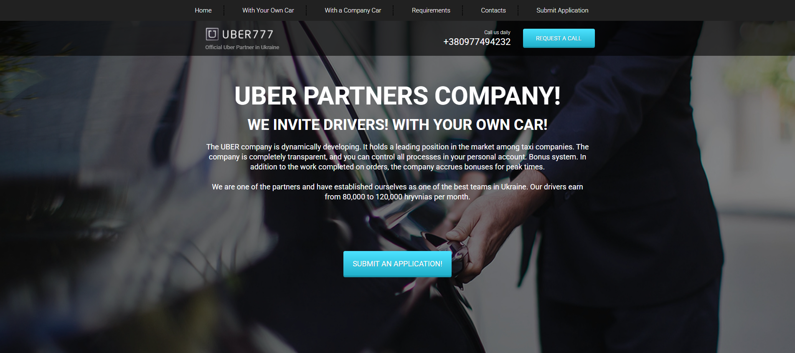

# Responsive Website with Bootstrap Grid, Flexbox, and SASS

This project is a fully responsive website built with HTML, CSS (SASS), and JavaScript. It features a layout powered by Bootstrap Grid, making it adaptable to all screen sizes, from mobile devices to large desktops. Additionally, Flexbox is used for certain layout components, and a JavaScript script enhances the mobile navigation menu for better usability.

## Live Demo
You can view the live version of this website at:
[Live Demo](https://wonderful-mochi-d32a5e.netlify.app/)

## Features

- **Responsive Design**: The website layout adjusts seamlessly to various screen sizes, ensuring a great user experience across all devices.
- **Bootstrap Grid**: Utilizes Bootstrap Grid for creating a responsive and fluid layout.
- **Flexbox Layout**: Flexbox is used for specific components to create a flexible and efficient layout.
- **Mobile Navigation**: A JavaScript-powered menu has been implemented for mobile devices to improve accessibility and navigation.
- **SASS**: The project uses SASS for more efficient and modular styling, allowing for better maintainability and scalability.

## Technologies Used

- HTML5
- CSS3 (Flexbox, Bootstrap Grid)
- SASS (Sass)
- JavaScript (for mobile menu functionality)

## Installation

1. Clone the repository:
   ```bash
   git clone https://github.com/yurazablotskiy/Uber_patners.git
